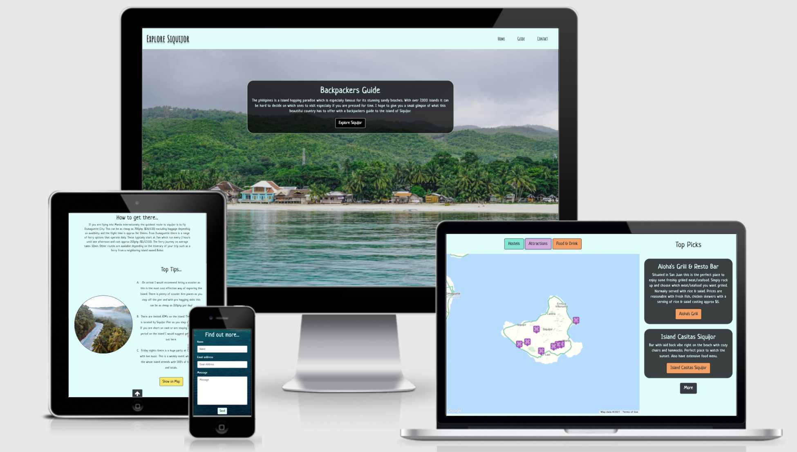
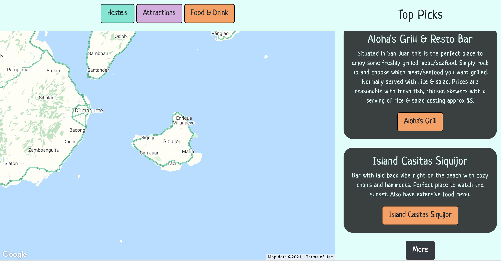
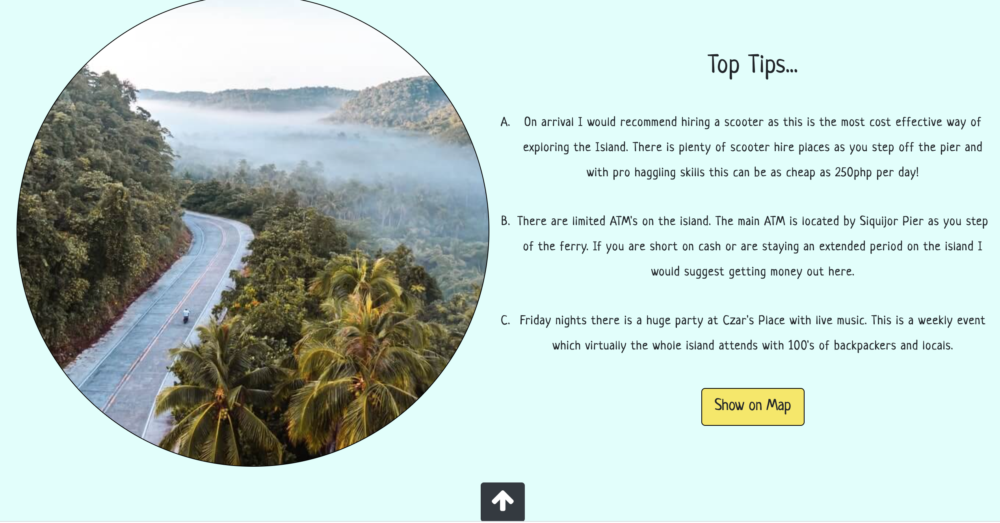
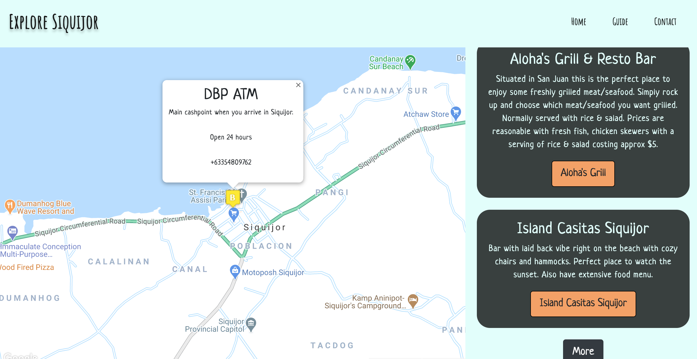
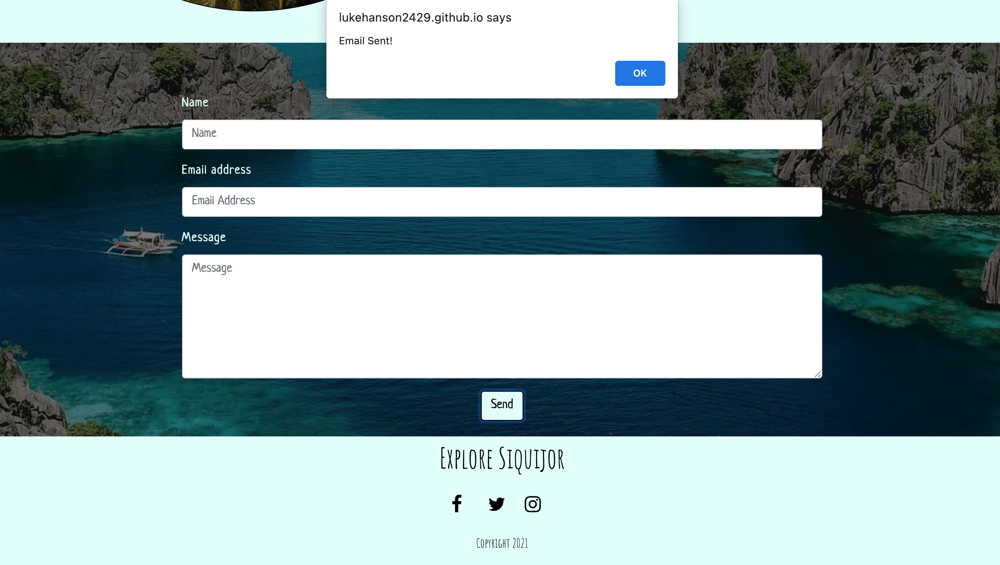

# Explore Siquijor - Milestone Project 2

[View the live project here.](https://lukehanson2429.github.io/Explore-Siquijor/)

## Project Overview

The Project goal is to create a clear, concise and user friendly website for a travel webiste - Explore Siquijor, a backpackers guide to Island of Siquijor in the Philippines. The website purpose is aimed at backpackers to provide a guide on what the island has to offer before visiting.

## Project Goals

* The Website must be fully responsive on all devices.
* To help the user make an informed decision before visiting Siquijor.
* Clear design presentation which allows the the user to navigate easily.
* To maximise future maintainability through documentation, code structure and organisation.
* To provide significant interactivity through a google maps API which will benefit the User with a clean UX.
* To be able to contact the site owner through email.js should they have any further questions.
* The target users will be for backpackers/travellers.

## User Stories (UX)

* As a new user I want to be able to understand the the purpose of the website.
* As a new user I want to be able to navigate intuitively.
* As a new user If I'm interested in visiting how do I get there?
* As a new user what does the site owner recommend.
* As a new user how do I find out what hostels, restaurants/bars & attractions are on the island.
* As a new user are there any additional things I should know before visiting.
* As a new user I would like to get in contact to find out more.

## Design

### 1. Colour Scheme
* A very light blue - rgba(225, 254, 251, 1) has been used as the main background color for the Navbar, Footer & background as blues can be associated with the crystal clear waters at beaches in the Philippines. 
* The buttons have various colours which match the icon colors which help make it clearly identifable which icon category is associated with each button. Food & drink button - rgba(245, 161, 97, 1), Hostel button - rgba(130, 228, 211, 1);, attractions button - rgba(212, 173, 222, 1); These colors have also been selected so the black text is easy to read.
* The google maps api color scheme of atlas has been selected as it ties in nicely with the light blue background color.
* Icons on the map are slightly darker versions of the button colors so they are easily visble on the map.
* Text is either black or light blue - rgba(225, 254, 251, 1) across the webpage depending on background color.

Contrast Checker used to check colors of buttons match with text so its easy to read - [Contrast Checker](https://contrastchecker.com/?c=000000&b=1155dd)

### 2. Typography
* The font style of Amatic SC has been chosen for the website brand/logo (Explore Siquijor) within the header & footer. This hand drawn web font is designed to give a rustic feel to the website brand.
* The font style of Neucha has been selected for all other content which is a relaxed style selected to represent the relaxed vibe of the island.
* All font has a letter spacing of 0.05em to make it easier to read.
* The fallback fonts across all webpages is sans serif for any reason the main fonts do not import correctly.

### 3. Imagery
* 3 different Phillipines images with varying scenery to grab the users attention. On a slow fade in a carousel on landing on the home page.
* Upon clicking the top tips button an image of someone riding a scooter along a scenic road surrounded by tropical scenery is designed to engage the user to inspire adventure.
* Background image on opaque overlay on form has been selected as it fits in with the color scheme and shows the beauty of the coastline in the Philippines.

### 4. Icons
* Arrow icons have been used from [Font Awesome](https://fontawesome.com/v4.7.0/) to make the UX simple to use with interactivity.
* Icons have been used from [Font Awesome](https://fontawesome.com/v4.7.0/) in the footer for Social Links.

## WireFrames

Initial Wireframe designs made on Figma:

* [Desktop](readme-docs/wireframes/desktop.jpg) 
* [Mobile](readme-docs/wireframes/mobile.jpg) 

Original design has been significantly altered throughout the process of my project to improve the UX & UI:
* Top pick section moved next to Map so the main guide is all on one page to improve UX.
* Opening paragraph & button on home page centred so it grabs the users attention.
* Top tips section added for additional info which is helpful for the user.

## Features

* Responsive on all devices.

* Dropdown hamburger menu on mobile devices using Bootsrap.
    * Upon clicking a nav link this menu will hide and scroll using js (Same for desktop).
* Navbar collapse on scroll using js.
* Bootstrap Carousel for landing home page on a slow fade to grab users attention.
* Bootstrap Booking Form on Contact page using EmailJS which allows the user to send an email. Success or error message on send & value fields reset.
    * Email field if incorrect value is entered error message will show.
* Google MAPS API utilised which shows icons for various categories by clicking associated button.
    * Categories are the following: Hostels, Attractions, Food & drink, Top Picks (6 different) & Top tips
    * Icons have various information for the user such as address, telephone, opening times & website link within the info window.
    * Buttons clicked will smooth scroll to the map section of the page, especially user friendly while interacting on a mobile device.
    * On click of MAP icon map zooms to icon location and info window pops up for icon.
    * On mouse out of MAP area zoom resets to original zoom.
* Font Awesome arrow icons have interactivity within the webpage which toggle, show, scroll or hide content using jquery.
* Font Awesome Social/Interactive Links.
    
### Features left to implement

* Current Weather via API
* Foreign Exchange Currency comparison to Philippines Peso via API
* Gallery Section

### Languages Used

* [HTML5](https://en.wikipedia.org/wiki/HTML5)
* [CSS3](https://en.wikipedia.org/wiki/CSS)
* [Javascript](https://en.wikipedia.org/wiki/JavaScript) 

### Frameworks, Libraries & Programs Used

1. [Bootstrap](https://getbootstrap.com/)
    * Bootstrap was used to assist with the responsiveness across the entire website.
2. [Google Fonts](https://fonts.google.com/)
    * Google fonts were used to import the 'Amatic SC & Neucha' fonts into the style.css file.
3. [Font Awesome](https://fontawesome.com/)
    * Font Awesome was used to add icons for aesthetic and UX purposes.
4. [JQuery](https://jquery.com/)
    * jQuery used for certain Javascript functions such as toggle, show, scroll or hide content.
5. [Gitpod](https://www.gitpod.io/)
    * The Interactive Development Envvironment to code the website. Git was used for version control by utilizing the Gitpod terminal to commit to Git and Push to GitHub.
6. [Github](https://github.com/)
    * GitHub is used to store the projects code after being pushed from Git.
7. [Figma](https://www.figma.com/)
    * This was used to create my wireframe designs for desktop/mobile formats.
8. [Chrome Dev Tools](https://developer.chrome.com/docs/devtools/)
    * To assist with debugging code and assessing perforamnce through lighthouse.
9. [Contrast Checker](https://contrastchecker.com/)
    * Used to make sure the contrast in colors is suitable for my design & everything is easy to read.
10. [FavIcon](https://favicon.io/favicon-generator/)
    * Used to make custom Icon for website.
11. [Google Maps API](https://developers.google.com/maps/documentation/javascript/overview)
    * For interative Map with icons.
12. [EmailJS](https://www.emailjs.com/)
    * For User to to send an email.
13. [AmIResponsive](http://ami.responsivedesign.is/)
    * Used to created mock up of website.
14. [TinyPNG](https://tinypng.com/)
    * Used to compress images to increase performance.
14. [Maps Marker Icons](https://mapicons.mapsmarker.com/)
    * Custom Map Icons used for Interactive Map.

## Testing

The W3C Markup Validator, W3C CSS Validator Services & Jshint were used to validate every page 
of the project to ensure there were no errors/warning within my code. Results below:

* [W3C Markup Validator](readme-docs/validation/htmlval.png)
* [W3C CSS Validator](readme-docs/validation/cssval.png)
* [Jshint main.js](readme-docs/validation/mainjshint.png)
* [Jshint maps.js](readme-docs/validation/mapsjshint.png)
* [Jshint sendemail.js](readme-docs/validation/emailjshint.png)

### User Stories Testing

1. As a new user I want to be able to understand the the purpose of the website.
    * Opening landing page description explains purpose of website for user.
    * Carousel image on landing page provides a feel for the website and indicates that its a travel website.

2. As a new user I want to be able to navigate intuitively.
    * Smooth scrolling when clicking on navlinks, buttons & icons engange the user and have a response 
    that you would expect.

As an example on click of Guide button in Navbar page smooth scrolls to guide section:

3. As a new user If I'm interested in visiting how do I get there?
    * How to get there section explains the route to the island to see if this fits in with the itinerary of your 
    trip. Under Map Section:

4. As a new user what does the site owner recommend.
    * Top Picks sections provides info on recommended hostels, attraction, restaurants & bars. Upon clicking arrow button additional top picks are visble in scroll container to the right of map:

Marker Icon for individual top pick visible on clicking each button with info window for each. Example below:

5. As a new user how do I find out what hostels, restaurants/bars & attractions are on the island.
    * Within the map section of the page each category of icons can be shown on the map by clicking category buttons.
    * Futher info availble on click of icons as mentioned above on point 4.

Example of Attractions map icons after button category clicked:

6. As a new user are there any additional things I should know before visiting.
    * Top Tips provides further valuable information which may be helpful before you visit which also links to 
    the map to show icon location and more info.

After clicking top tips arrow:

By clicking on top tips button to show icons on the map, info window can be viewed upon clicking markers:

7. As a new user I would like to get in contact to find out more.
    * If further info is needed the site owner can be emailed in the contact section.

### Functionality Testing

#### Navigation menu

* Navlinks smooth scroll to desired section of page.
* On scroll of browser Navbar will hide & show.
* On a mobile display with the dropdown hamburger menu on selection of desired section Navbar will hide.

#### Buttons:

* Landing Hero image named Explore Siquijor smooth scrolls to map section.
* Hostel, Attractions, Food/Drink, Top Picks & Top Tip buttons for the map API call various icons as intended all color coded for a clean UX.
* Smooth scroll to desired location of website also when clicking buttons.
* Send Button in contact section sends email as intended and provides a success alert.

#### Map Functionality:

* Map initializes on website load.
* Map icons Zoom to marker position on click and open info window.
* On mouse out map zooms to original zoom.
* Marker info windows include additional information such as Phone, Address, opening times & website link.

#### Font Awesome Arrow Buttons:

* Top Picks arrow button on click shows more top picks & smooth scrolls to next Top Picks.
* Top Tips section toggles on click which shows further information/imagery & hides how to get there section.

#### Contact Form:

* All fields required in contact form to send an email.
* If email field has been filled out incorrectly an alert will show.
* Send Button in contact section sends email as intended and provides a success alert or error if unsuccessful.

#### Social Media Icons:

* Open to a new webpage as intended.

### Responsive Design Testing:

* The website has been viewed on a variety of devices through chrome dev tools such as Desktop, Laptop, iPhone 6/7/8, moto g4 &ipad/ipad mini all functioning correctly and responsive.
* Tested on Google Chrome & Mozilla Firefox Browsers all functioning correctly.
* Minor Bug on safari desktop which was unintended - once scrolled back to top of the page Navbar does not return, however this is not a major issue as Navbar returns on scroll and is also visible when website initializes.

### Lighthouse Performance Testing:

* Average performance on mobile but within acceptable parameters:

* Exceptional performance on desktop:

## Encountered Issues

* Top Tips image displaying incorrectly on smaller devices. Fixed by using media queries:

@media (max-width: 464px) {
    #top-tip-img {
        height: 325px;
        width: 325px;
        margin-bottom: 20px;
    }
}

@media (max-width: 800px) {
    #top-tip-img {
        height: 325px;
        width: 325px;
    }
}

* Scroll container arrow not visible on a mobile device, solved using media queries by setting scroll container height to 100vh:

@media (max-width: 619px) {
    .scroll-container {
    height: 100vh;
}

* Dropdown hamburger menu not hiding while scrolling on mobile device. Solved by hiding Navbar on click on Navlink using Javascript:

$(".navbar-nav>li>a").click(function () {
    $(".navbar-collapse").collapse("hide");
});

* Google maps console log error - initializtion: Uncaught (in promise) TypeError: Cannot read property 'length' of undefined. To solve this I created a small seperate function which initilises a map when the webpage loads which doesn't involve a for loop:

// Variable for initial Map on Page Load
let mapInitial;

// Function to load initial Map 
function initMap() {
    mapInitial = new google.maps.Map(document.getElementById("map"), {
        mapId: "58081ee022056e14",
        center: { lat: 9.186013, lng: 123.580776 },
        zoom: 10,
        disableDefaultUI: true,
    });
}

## Deployment

### GitHub Pages

The project was deployed to GitHub Pages using the following steps...

1. Log in to GitHub and locate the GitHub Repository.
2. At the top of the Repository, locate the "Settings" Button on the menu.
3. Scroll down the Settings page until you see the "GitHub Pages" Section.
4. Under "Source", click the dropdown called "None" and select "Master Branch".
5. The page will automatically refresh.
6. Scroll back down through the page to locate the now published site in the "GitHub Pages" section.

### Making a Local Clone

1. Log in to GitHub and locate the GitHub Repository.
2. Under the repository name, click "Clone or download".
3. To clone the repository using HTTPS, under "Clone with HTTPS", copy the link.
4. Open Git Bash
5. Change the current working directory to the location where you want the cloned directory to be made.
6. Type `git clone`, and then paste the URL.
7. Press Enter. Your local clone will be created.

## Credits

### Content

* Icon description, telephone & address for map icons sourced from google maps.
* Website links added to icons for TripAdvisor, Booking.com or direct website if available.
* All other content written by developer.

### Code

* Bootstrap Navbar & Carousel based on boostrap templates & significantly changed to suit my website.
* EmailJS function based on code institute Lesson and adjusted to suit my project
* Stack Overflow & W3Schools - Links within comments in code.

### Media 

* Home Page Carousel image 1 - [Unsplash](https://unsplash.com/photos/2rH2w01umhY)
* Home Page Carousel image 2 - [Unsplash](https://unsplash.com/photos/MGUC3WkLkWM)
* Home Page Carousel image 3 - [Unsplash](https://unsplash.com/photos/YXzQe8JHvwc)
* Top Tips Image - [Unsplash](https://unsplash.com/photos/jMCOul3CK9U)
* Contact Form Image - [Unsplash](https://unsplash.com/photos/IL-fBBnF-GU)

### Acknowledgements

My Mentor Medale Oluwafemi has been very helpful with Feedback/Guidance.

Slack community for feedback & suggestions.

Code institute with supportive content and Tutor Support.

